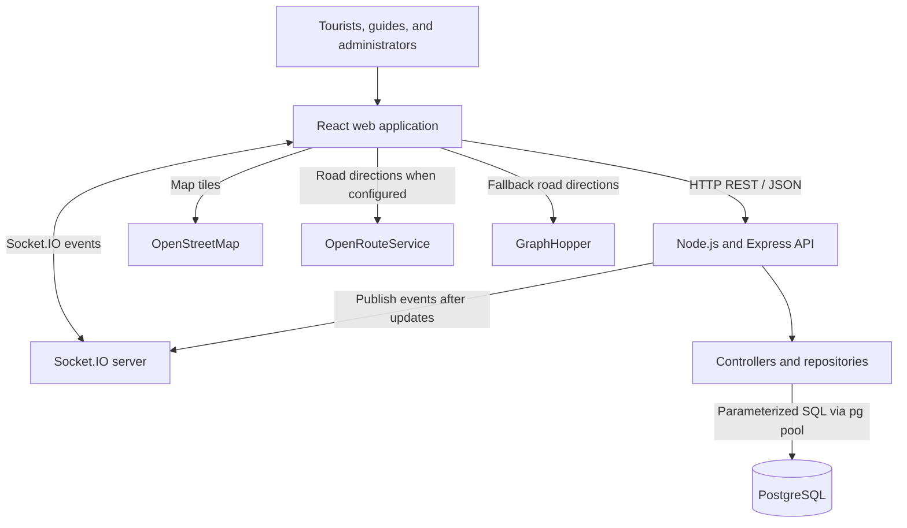

[comment]: # "This is the standard layout for the project, but you can clean this and use your own template, and add more information required for your own project"

<!-- Once you fill the index.json file inside /docs/data, please make sure the syntax is correct. (You can use this tool to identify syntax errors)

Please include the "correct" email address of your supervisors. (You can find them from https://people.ce.pdn.ac.lk/ )

Please include an appropriate cover page image ( cover_page.jpg ) and a thumbnail image ( thumbnail.jpg ) in the same folder as the index.json (i.e., /docs/data ). The cover page image must be cropped to 940×352 and the thumbnail image must be cropped to 640×360 . Use https://croppola.com/ for cropping and https://squoosh.app/ to reduce the file size.

If your followed all the given instructions correctly, your repository will be automatically added to the department's project web site (Update daily)

A HTML template integrated with the given GitHub repository templates, based on github.com/cepdnaclk/eYY-project-theme . If you like to remove this default theme and make your own web page, you can remove the file, docs/_config.yml and create the site using HTML. -->

# Smart Tourism Management System

---

## Team

-  E/23/161, Kanchana K.L.A.Y.R., [e23161@eng.pdn.ac.lk](mailto:e23161@eng.pdn.ac.lk)
-  E/23/187, Kumarasinghe K.M.D.S., [e23187@eng.pdn.ac.lk](mailto:e23187@eng.pdn.ac.lk)
-  E/23/202, Liyanagama K.L.D.H., [e23202@eng.pdn.ac.lk](mailto:e23202@eng.pdn.ac.lk)
-  E/23/300, Ranathunga S.M.R.S., [e23300@eng.pdn.ac.lk](mailto:e23300@eng.pdn.ac.lk)

<!-- Image (photo/drawing of the final hardware) should be here -->

<!-- This is a sample image, to show how to add images to your page. To learn more options, please refer [this](https://projects.ce.pdn.ac.lk/docs/faq/how-to-add-an-image/) -->

<!--  -->

#### Table of Contents

1. [Introduction](#introduction)
2. [Solution Architecture](#solution-architecture)
3. [Software Designs](#software-designs)
4. [Testing](#testing)
5. [Conclusion](#conclusion)
6. [Links](#links)

## Introduction

Planning a trip involves finding destinations, arranging a practical route, locating suitable guides, and agreeing on services and prices. When this information is spread across separate websites and conversations, tourists must repeatedly share their plans, while guides have limited visibility into relevant travel requests.

The **Smart Tourism Management System** brings these activities together in a web application focused on travel in Sri Lanka. Tourists can explore destinations, build itineraries, view routes on a map, discover guides who cover their selected locations, request quotations, and communicate with guides. Guides can maintain profiles, respond to requests, and quote prices in LKR or USD. Administrators have interfaces for managing users and moderating reviews.

The intended impact is to reduce planning effort, improve the visibility of local guides, and keep trip discussions and quotations in one place. These are expected benefits of the design; reductions in planning time, user satisfaction, and commercial impact have not yet been measured through a user study.


## Solution Architecture

The application uses a three-tier architecture: a React presentation layer, a Node.js/Express application layer, and a PostgreSQL data layer. REST endpoints handle persistent operations, while Socket.IO delivers chat and notification events to connected clients.



The browser sends application requests to Express. Routes select a controller, controllers coordinate the operation, and repositories read or update PostgreSQL. The API and Socket.IO server share the same Node.js HTTP server. Map tiles and road directions are requested directly by the browser from external providers.

For example, a guide submits a quotation through the REST API. The backend updates the booking and stores a notification, then emits a Socket.IO event to the tourist's user room. The tourist can retrieve the saved booking and notification through the API even after reconnecting.

### Technology Stack

| Layer | Technologies | Responsibility |
| --- | --- | --- |
| Web interface | React 18, React Router, CSS | Pages, navigation, forms, and dashboards |
| Client state and requests | React Context, Axios | Session state, shared destination state, and API calls |
| Maps | Leaflet, React Leaflet, OpenStreetMap tiles | Destination markers and itinerary visualization |
| Directions | OpenRouteService, GraphHopper | Road geometry, distance, and estimated driving time |
| Application server | Node.js, Express 5 | REST endpoints and business operations |
| Live updates | Socket.IO | Booking conversations and notification events |
| Data storage | PostgreSQL, node-postgres (`pg`) | Relational records, constraints, and pooled queries |
| Authentication components | bcrypt, JSON Web Tokens | Password hashing and login token generation |
| Verification | Jest, React Testing Library, Supertest, Playwright, GitHub Actions | Unit, integration, browser tests, and CI |

## Software Designs

### 1. User Roles and Main Workflows

| Role | Supported workflows |
| --- | --- |
| Visitor | Browse destinations and guides; register or log in |
| Tourist | Maintain a profile, manage itineraries, request guides, accept or reject quotes, exchange messages, and review places and guides |
| Guide | Maintain a professional profile and covered locations, view booking requests, submit quotes, and communicate with tourists |
| Administrator | View and delete tourist or guide accounts, moderate place and guide reviews, and update destination images |

These describe the implemented interfaces and operations. Complete server-side enforcement of role permissions remains a development requirement, as discussed below.

### 2. Frontend Organization

The [React source](../client/src) separates page components, reusable interface components, shared contexts, and API services.

- **Pages:** home, destination listing and details, registration, login, dashboard, itineraries, guides, clients, notifications, and administration.
- **Reusable components:** navigation, destination cards, search, reviews, profile editing, password changes, and image cropping.
- **`AuthContext`:** stores the current user and token, restores the session from local storage, and manages the unread notification count and user socket connection.
- **`PlaceContext`:** provides shared destination state.
- **API services:** centralize requests using Axios. The request interceptor attaches a stored bearer token; a non-authentication request returning HTTP 401 clears the session and redirects to login.
- **`ProtectedRoute`:** redirects visitors without a client session to the login page.

### 3. Backend Organization and API Design

The [backend source](../server/src) follows a route-controller-repository structure. Routes define HTTP methods and paths, controllers process requests and return JSON responses, and repositories contain SQL operations. The database connection module uses a pool to reuse PostgreSQL connections.

| API prefix | Main responsibilities |
| --- | --- |
| `/api/auth` | Account registration and login |
| `/api/places` | Destination search, details, and place reviews |
| `/api/users` | Profiles, password changes, account deletion, statistics, and a tourist's itineraries |
| `/api/itineraries` | Create, retrieve, update, or delete itineraries; add or remove destinations |
| `/api/guides` | Guide listings, details, itinerary-based suggestions, and guide reviews |
| `/api/bookings` | Booking requests, quotations, acceptance, rejection, cancellation, and messages |
| `/api/notifications` | Notification lists, unread counts, and read-state updates |
| `/api/admin` | User management, review moderation, and destination image updates |
| `/api/status`, `/api/system/status` | Application status endpoints |

Controllers use HTTP status codes such as 201 for creation, 400 for invalid requests, 401 for rejected login attempts, 404 for missing records, and 500 for server failures. Validation and error handling vary between endpoints and need broader automated coverage.

### 4. Relational Data Model

The [SQL migrations](../server/src/database/migrations) define the following main entities:

| Entity | Purpose and relationships |
| --- | --- |
| `users` | Unique email, password hash, and tourist, guide, or admin role |
| `tourist_profiles` | One profile per tourist user, with personal and contact information |
| `guide_profiles` | One profile per guide user, including coverage, experience, languages, and rates |
| `places` | Destination name, description, category, coordinates, and image URL |
| `itineraries` | Trip title and dates, linked to a tourist user |
| `itinerary_items` | Links destinations to itineraries with a visit order and notes |
| `bookings` | Links an itinerary, tourist, and guide; stores status, quotation, currency, and timestamps |
| `booking_messages` | Messages linked to a booking and author, with edit and deletion metadata |
| `place_reviews`, `guide_reviews` | Tourist ratings and comments linked to places or guides |
| `notifications` | Per-user events with type, message, reference identifier, and read state |

A tourist can own multiple itineraries, and each itinerary can contain multiple destinations through `itinerary_items`. An itinerary can have requests to multiple guides. Each booking can contain multiple messages. Foreign keys maintain relationships, review ratings are constrained to 1–5, and a unique itinerary/place constraint prevents duplicate destinations within the same itinerary. Deletion behavior is defined by the migrations, including restricting deletion of places referenced by itinerary items.

### 5. Destination Discovery and Itinerary Mapping

Tourists can search destinations and filter by category, inspect details and reviews, and add destinations to an itinerary. The itinerary stores trip dates and ordered destination records; the map displays their coordinates and connecting route.

The routing implementation first tries OpenRouteService when `REACT_APP_ORS_TOKEN` is configured, then falls back to GraphHopper. Successful responses supply the route geometry, distance in kilometres, and estimated driving time. If road routing fails, the interface displays straight-line connections and an explanatory message. These lines are a visual fallback, not navigable road directions. Route visualization does not establish that the visit order is globally optimal.

### 6. Guide Matching

Guide suggestions compare itinerary destination names with the guide's declared covered locations. Guides with matching locations are ranked primarily by the number of matched places, with a score incorporating location matches, specialization, and experience. A separate request operation finds guides whose coverage text matches itinerary place names and creates booking requests.

This is rule-based matching using profile information. Availability calendars, verified credentials, geographic proximity, and machine-learning recommendations are not established by the current matching implementation.

### 7. Booking and Quotation Workflow

1. A tourist creates an itinerary and requests one or more guides.
2. A booking is stored with an initial `pending` status.
3. A guide supplies a quotation and currency, changing the status to `quoted`.
4. The tourist can accept or reject the quotation; cancellation is also supported.
5. Participants coordinate through the booking conversation and receive relevant notifications.

The stored statuses include `pending`, `quoted`, `accepted`, `rejected`, and `cancelled`. They describe the intended workflow; comprehensive transition validation and authorization still need testing and hardening. LKR and USD quotation support records a price and currency; it does not process payments or perform currency conversion.

### 8. Messaging and Notifications

Messages are saved through REST endpoints and delivered to booking rooms named `booking_<id>` using Socket.IO. Clients can receive new-message, edit-message, and delete-message events. Message editing includes an author comparison and a one-hour edit window; deletion metadata supports the conversation's deleted-message behavior.

Personal rooms named `user_<id>` receive notification events. Notification records remain in PostgreSQL, allowing the interface to load history, show unread counts, and mark notifications as read.

### 9. Authentication and Current Security Boundaries

Registration hashes passwords with bcrypt, and successful login issues a JWT containing the user's identifier, email, and role. The frontend stores the session locally and sends the token in API requests.

The current route files do not attach JWT verification or role-authorization middleware, and Socket.IO room joins accept client-supplied identifiers. Client route protection therefore does not establish server-side access control. Before a public launch, the system needs authenticated API and socket access, ownership checks, restricted administrative operations, stronger input validation, and removal of password logging from the login controller. Guide approval and verification fields in the schema should not be treated as a completed verification service.

### 10. Configuration and Delivery

The frontend and backend run as separate processes, normally on ports 3000 and 5000 during local development. `REACT_APP_API_URL` selects the backend address. The server reads database connection settings and JWT configuration from environment variables. Database migrations and seed data are executed through the server's npm scripts; starting the server does not automatically run migrations.

The [CI workflow](../.github/workflows/ci.yml) uses Node.js 20 and PostgreSQL 16 service containers for database-dependent jobs. It runs server unit, client unit, and server integration jobs before browser tests. A subsequent production-build job is configured for `main` and `dev`. The root hosting package separately requests Node.js 24, so runtime versions should be aligned before deployment. See the [root README](../README.md) for the local setup walkthrough.

## Testing

### Test Strategy

The repository contains three levels of automated checks: isolated utility/rendering tests, API integration tests against PostgreSQL, and browser tests against running frontend and backend services. Their scope is limited; the presence of a test file does not establish that the associated feature has passed a full system test.

### Detailed Test Coverage

| Suite | Defined tests | What is checked |
| --- | ---: | --- |
| [Authentication utilities](../server/__tests__/unit/authController.test.js) | 6 | bcrypt hash creation, correct/incorrect password comparisons, JWT creation, payload decoding, and tampered-token rejection |
| [Status smoke test](../server/__tests__/unit/systemController.test.js) | 1 | HTTP 200 and selected response fields using a minimal Express app that reproduces the status route |
| [React rendering smoke test](../client/src/__tests__/App.test.js) | 1 | Rendering and text assertions for a small test component |
| [Authentication integration](../server/__tests__/integration/auth.integration.test.js) | 5 | Tourist registration, duplicate registration rejection, successful login, wrong password, and unknown account |
| [Places integration](../server/__tests__/integration/places.integration.test.js) | 2 | Destination-list response structure and search results for a temporary database fixture |
| [Browser authentication](../e2e/tests/auth.spec.js) | 2 | Registration through the UI with dashboard navigation, and login-page password-field visibility |
| [Browser/API smoke checks](../e2e/tests/smoke.spec.js) | 3 | Homepage title, non-empty page body, and active backend status |

There are **20 defined tests** across these files. The authentication unit tests exercise bcrypt and JWT directly rather than the actual authentication controller. The status unit test reproduces a route rather than importing the production application, and the React test renders a small component rather than the complete `App`. The browser login-page test can be skipped if its link selector finds no match, and it does not submit credentials. The homepage test checks the page title but does not explicitly assert an HTTP 200 response despite its test name.

### Verified Results

Local verification on **25 September 2026** produced the following results:

| Test level | Result | Interpretation |
| --- | --- | --- |
| Server unit | **7 passed; 2 suites passed** | All existing isolated backend checks passed |
| Client rendering | **1 passed; 1 suite passed** | The existing rendering smoke check passed; a React test-utils deprecation warning was emitted |
| API integration | Not run during this documentation update | Requires a dedicated migrated PostgreSQL test database |
| Browser end-to-end | Not run during this documentation update | Requires a test database, both application services, and Playwright Chromium |

No overall pass rate, measured performance result, or coverage percentage is claimed for the complete system. Integration and browser definitions were reviewed, but their current execution results were not verified. Database-dependent tests create records and should run against an isolated test database.

### Reproducing the Tests

Run these commands from the repository root after installing each package's dependencies:

```bash
# Isolated backend checks
npm --prefix server run test:unit -- --runInBand

# Frontend rendering check
npm --prefix client test -- --watchAll=false --ci --runInBand

# Configure the server to use a dedicated test database before these steps
npm --prefix server run db:migrate
npm --prefix server run test:integration

# With the test backend and frontend running, and Chromium installed
npm --prefix e2e test
```

The [Playwright configuration](../e2e/playwright.config.js) uses `BASE_URL` for the frontend; the API smoke test uses `API_URL` for the backend. Defaults are `http://localhost:3000` and `http://localhost:5000`. Install the browser with `npx playwright install chromium` from the `e2e` directory. CI prepares migrations and seed data, starts both services, and retains coverage and browser report artifacts. Its browser command explicitly selects HTML and list reporters; the default local configuration additionally writes a JUnit report.

### Remaining Validation

Further work should cover itinerary persistence and ordering, matching accuracy, quote transitions, chat editing and deletion, notification read states, reviews, and administrative operations. Priority negative tests include expired or forged tokens, unauthorized access to another user's records, and unauthorized socket-room joins. Routing-provider failures, reconnect behavior, accessibility, mobile layouts, concurrent bookings, and load performance also require validation. User acceptance testing should measure task completion and collect tourist and guide feedback before commercial release.

## Conclusion

### What Was Achieved

The project implements a full-stack prototype connecting destination discovery, itinerary creation, map-based route display, guide suggestions, quotation management, persistent conversations, and notifications. Separate tourist, guide, and administrator interfaces support the main participants. PostgreSQL migrations provide a shared data model, and the repository includes an automated testing and CI foundation.

The verified isolated test results support the specific checks listed above. Broader workflow correctness, production security, scalability, and real-world impact still require validation; the prototype should not yet be described as a production-ready booking marketplace.

### Future Development

- **Access control and reliability:** enforce JWT authentication, role and ownership checks, authenticated socket rooms, consistent input validation, and tested booking transitions.
- **Trust and availability:** implement guide verification and approval workflows, availability calendars, and prevention of conflicting bookings.
- **Trip planning:** improve location matching, add geographic search, and evaluate route ordering using travel time, budgets, and opening hours.
- **Payments:** integrate payment collection, receipts, refunds, and cancellation policies with explicit currency handling.
- **User experience:** add multilingual content, accessibility improvements, stronger mobile support, and useful reconnect/offline behavior.
- **Operational readiness:** expand tests, align runtime versions, manage provider keys and quotas, and add monitoring, backups, and recovery procedures.

### Proposed Commercialization Plan

An initial pilot could involve a small group of local guides and tourists in selected Sri Lankan destinations. The pilot should evaluate successful guide matches, quotation acceptance, completed trips, support effort, and user satisfaction before expanding coverage.

Possible revenue models include a commission on completed paid bookings, an optional guide subscription for additional business tools, and partnerships with tour operators or accommodation providers. These are proposals, not implemented revenue streams or confirmed partnerships. Pricing and demand should be validated through interviews and pilot usage.

A commercial launch depends on verified access control, trusted guide onboarding, reliable booking and payment workflows, customer support, and appropriate privacy and cancellation policies. Hosting, mapping, payment processing, and support costs should be assessed against pilot demand to determine whether the service is financially sustainable.

## Links

- [Project Repository](https://github.com/cepdnaclk/{{ page.repository-name }}){:target="_blank"}
- [Project Page](https://cepdnaclk.github.io/{{ page.repository-name}}){:target="_blank"}
- [Department of Computer Engineering](http://www.ce.pdn.ac.lk/)
- [University of Peradeniya](https://eng.pdn.ac.lk/)

[//]: # (Please refer this to learn more about Markdown syntax)
[//]: # (https://github.com/adam-p/markdown-here/wiki/Markdown-Cheatsheet)
